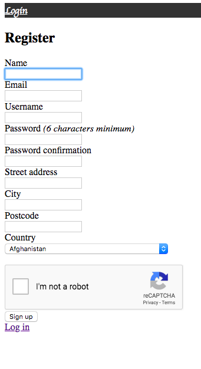
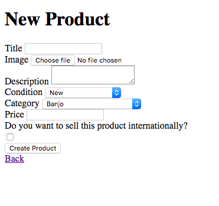
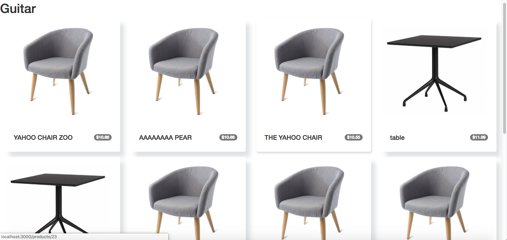
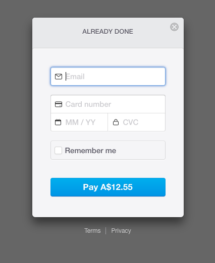
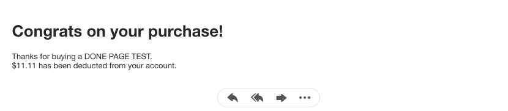
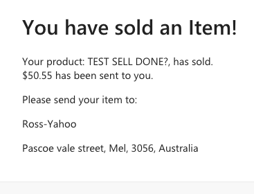
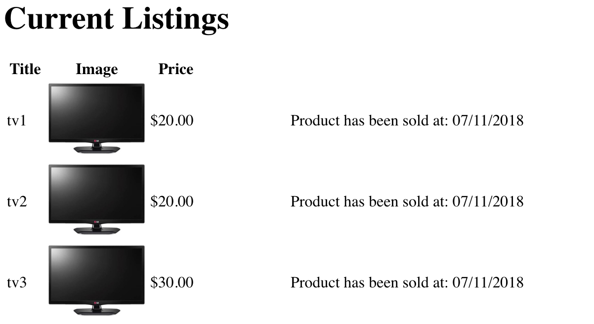
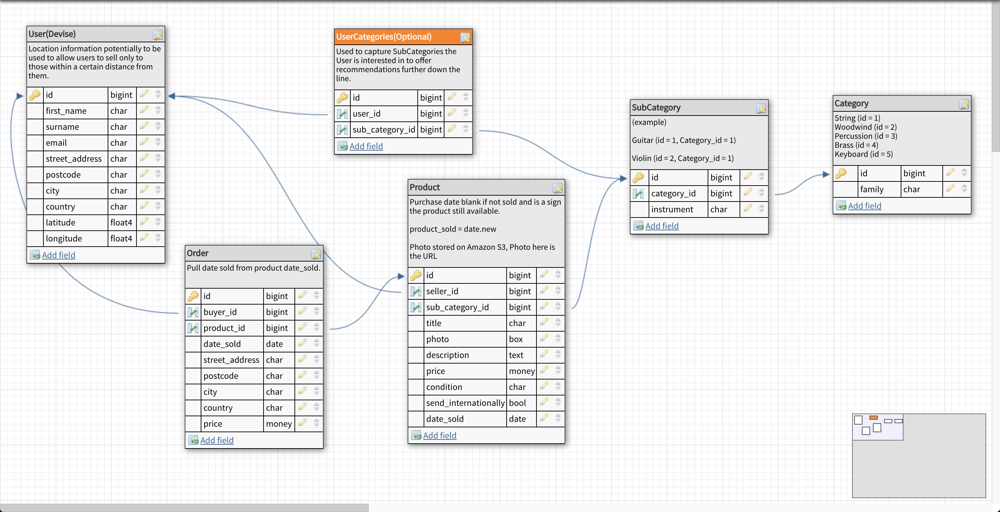

**Music Store**
===========
[Website](https://safe-lake-72049.herokuapp.com)

[GitHub Repo](https://github.com/ATaylor1181/musicstore)

A two-sided marketplace, speciallising in the buying and selling of musical instruments, and musical assessories.  
Allows users to sign up and start either selling their own musical products, or buy musical products from other sellers.

## **Features**  
---
Users will be able to Buy and Sell Musical related items from our two-sided marketplace once they sign up.





Users will also be able to browse through our Marketplace to see all we have on offer.



Make a Purchase through Stripe.



With a Confirmation Email to both Buyer and Seller.





Users will also see their own product listings.




## **Getting Started**  
---
### **Installing**
Once you have Cloned or Downloaded the Repository, with terminal, head into the right folder and run these commands:

Installing the require gems:
```
$ bundle install
```

Creating the database:
```
$ rake db:create
```

Migrating the Database:
```
$ rake db:migrate
```

Then finally, seed in the pre-requisite data from the seed.rb file:
```
$ rake db:seed
```

### **Note**  
You will need to create your own .env file in the root of the folder; containing your own API keys, for this to work.

Current API Keys you will need to accquire and named in this foramt in your .env file:  
_Stripe:_  
```
PUBLISHABLE_KEY=  
SECRET_KEY=
```

_Google's reCaptcha:_  
```
RECAPTCHA_PUBLIC_KEY=  
RECAPTCHA_PRIVATE_KEY=
```

_MailGun:_  
```
MAILER_ADDRESS=  
MAILER_DOMAIN=  
MAILER_USER_NAME=  
MAILER_PASSWORD=
```

**The current location of the _Amazon AWS S3 Bucket_ is in _Sydney, Australia_.  
If you want to make your own S3 bucket, you will need to sign up for [Amazon's AWS Service](https://aws.amazon.com/) and you will need to edit the _storage.yml_ file with your own details.**

## **Design Process**  
---
**Figma Wireframes**


## **Planning**  
---
**ERD Diagram**


**Trello Board**


## **Built With**
---
[Rails](https://rubyonrails.org/) - Built with the Rails Framework  
[Amazon's AWS service](https://aws.amazon.com/) - Used to Store Image Uploads  
[Heroku](https://www.heroku.com/) - Used to Host Website  
[Stripe](https://stripe.com/) - Used to Implement a Payment System


## **Authors**  
---
Ross Savill - [GitHub](https://github.com/Ross-Savill)

Alex Tayler - [GitHub](https://github.com/ATaylor1181)

Yong Liang - [GitHub](https://github.com/YongBong946)

## **Short Answer Questions**  
---
**1. What is the need (i.e. challenge) that you will be addressing in your project?**  
Our challenge for this project is to create a two-sided marketplace, which will allow users to be able to both buy and sell items.

**2. Identify the problem you’re trying to solve by building this particular marketplace App? Why is it a problem that needs solving?**  
Currently there isn't a two-sided marketplace which sells musical instruments and musical accessories, so we are trying to accommodate for those who want a hub to purely buy and sell new or used musical instruments and accessories.

**3. Describe the project you will be conducting and how your App will address the needs.**  
In our project we will be creating a two-sided marketplace that sells musical instruments and accessories. This marketplace will allow users to sign up and then start listing musical items to sell to other users who are intrested in buying them.

**4.Describe the network infrastructure the App may be based on.**  
For now the closest network infrastructure would be either Ebay or Gumtree. Those websites allow users to browse through all their product listings, and allow users to be able to sign up, and purchase items.

**5. Identify and describe the software to be used in your App.**  
We use Ruby on Rails to help us build our marketplace app. Ruby on Rails allows us to use Ruby in our HTML code to make our website. By using Ruby code, we can use code to pull data from our database, and easily display that on our webpage, and when we update our database, the webpage updates itself.

**6. Identify the database to be used in your App and provide a justification for your choice.**  
- We have 5 seperate tables in our database. User, Product, Order, Subcategory and Category.
- We have a User table to store all our data on the users who sign up, and we keep their data on what they sell and what they purchase.
- We have a Product table to store all the products users list on our marketplace app.
- Both the Category and Subcategory tables are there to help us and users easily sort out our different categories, making it easier to locate certain items.
- The Order table is there, to help us track which user has brought which item. 

**7. Identify and describe the production database setup (i.e. postgres instance).**  
  
We have chosen to do use 5 tables in our production database: User, Product, Order, Subcategory and Subcategory.  
When a User is new to our marketplace app, they can signs up, it'll make an instance from the User table. After user has signed up they will be able to start listing products to sell, if they list a product it'll create a Product instance, and everyone else will be able to see the listing. When a User purchases an item, it'll create a instance of the Order.

**8. Describe the architecture of your App.**  

We have a Welcome page when a user first enters our marketplace, and from there they will see the nav bar which will have the 5 instrument families: String, Keyboard, Percussion, Brass and Woodwind. They will be able to hover over the nav bar and links will appear. They will be able to click on any one of those links, and it'll redirect them to show all listings for the instrument they clicked on. From there they can browse the listings and then click on one, and see extra information about it, and they will be presented with an option to purchase the item.

**9. Explain the different high-level components (abstractions) in your App.**  
**Devise** - Devise helps us handle and store sensitive information like user's passwords.  
**Amazon S3** - Amazon S3 Service helps us store images that users upload to our marketplace.  
**reCaptcha** - Googles reCaptcha API and the reCaptcha gem allows us to put in a reCaptcha tick box to stop bots from signing up.  
**Stripe** - Stripe handles the payments, when the user purchases the item.
**dotenv** - dotenv allows us to store out API keys in our local environment, so that no one else has access to them.

**10. Detail any third party services that your App will use.**  
Our app will use these:  
[Devise](https://github.com/plataformatec/devise) - Used to generate secrutiy in our app with resticting users to buy and sell items unless they Login/Signup.  
[Stripe](https://stripe.com/au) - Used to accept User Payments for when they buy products from our app.  
[GeoCoder](https://github.com/alexreisner/geocoder) - Used locaion based service (Google Maps) in our app to determine and show location based data.

**11. Describe (in general terms) the data structure of marketplace apps that are similar to your own (e.g. eBay, Airbnb).**  
Our marketplace will be the most similar to Gumtree and Ebay. Users will be able to list their items that they would want to sell, with a Title, Description, Image and a Price.

**12. Discuss the database relations to be implemented.**  
We have 5 tables, User, Product, Order, Category and Subcategory. What we have to implement are:
- Users will have **many** Products.
- Users will have **many** Orders.
- One Product will have **one** User.
- One Product will have **one** Order.
- Catergory will have **many** Subcategories.
- One Order will have **one** User.
- One Product will have **one** Subcategory.


**13. Describe your project’s models in terms of the relationships (active record associations) they have with each other.**  
We have 5 tables, User, Product, Order, Category and Subcategory. The relationships that each table will have are:
- Users will have **many** Products.
- Users will have **many** Orders.
- One Product will have **one** User.
- One Product will have **one** Order.
- Catergory will have **many** Subcategories.
- One Order will have **one** User.
- One Product will have **one** Subcategory.

**14. Provide your database schema design.**  


**15. Provide User stories for your App.**  
As a User, I want to be able to see all the products that are being sold without signing up, so that I can make a decision whether or not I want to sign up and use the marketplace.
As a User, I want to be able to list products that I want to sell, so that I can make other users aware of what I am trying to sell, and hopefully get someone else to buy my product.
As a User, I want to be able to buy a product, so that I can get it.
As a User, I want to use a secure way to buy products from the marketplace, so that I won't have to worry about someone stealing my personal information.

**16. Provide Wireframes for your App.**  


**17. Describe the way tasks are allocated and tracked in your project.**  
We created a Trello board that has all the things we want to achieve and all the extra optional stuff we want to add to our app if we have the time. We each allocate a task to ourselves and update the Trello cards with our names on it, and move it to the "Doing" column, that way we know what each of our members are up to, and that way we won't be doubling up on the same task.

**18. Discuss how Agile methodology is being implemented in your project.**  
We come together everyday to discuss where each of us are up to in the project, what each of use are currently doing, and talk about what we want to accomplish by the end of the day. That way we know what everyone else in the group is doing so we don't double up on tasks. We also use a Trell Board to help us allocate tasks to ourselves and to let the rest of the team know what we are doing when we work on our marketplace when we aren't together in one room. 

**19. Provide an overview and description of your Source control process.**  
We used GitHub to create branches that we pushed and merged to the master file. GitHub helped us keep track of what has been merged to our main file.

**20. Provide an overview and description of your Testing process.**  
We made sure that before we pushed our new feature up to GitHub to be merged, we tested it. After every new feature we merged into the master file on GitHub, we pulled the latest version and then ran a test to make sure that the new feature didn't break any of the other features.

**21. Discuss and analyse requirements related to information system security.**  
Thanks to both **Devise** and **Stripe** gems they handle most the sensitive information about the user.   
Devise handles the passwords to the user's accounts.  
Stripe deals with users credit card details, so we wont have to worry about storing their payment details to our database.

**22. Discuss methods you will use to protect information and data.**  
We used Devise to allow users to be able to list and buy products from our app. If they dont sign in, they can only browse at our store, but will be unable to sell or buy products. Devise will be able to handle the security of passwords. We also use Stripe for our purchases, and stripe will handle all sensitive information users provide when purchasing an item.

**23. Research what your legal obligations are in relation to handling user data.**  
- Getting User Consent if we intend to distribute their data.
- Minimize permissions so that other people can't access other peoples information.
- Give your users a choice regarding data collection.